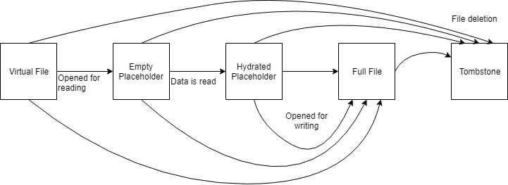
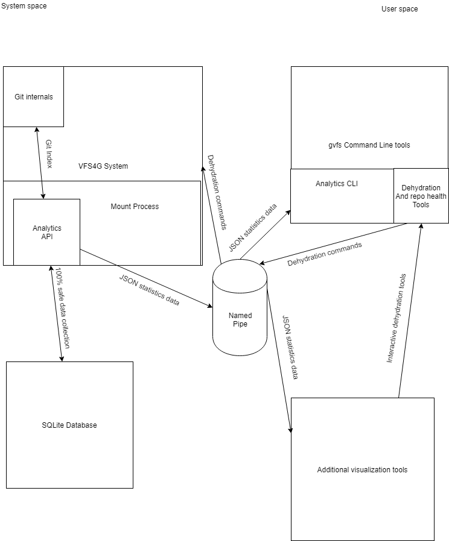

# VFS For Git: Analytics Tooling Design Document

This document details the design of and plan for the **VFS4G analytics tool**. The tool aims to help users identify reasons why their enlistment may be slowing down and the `git` commands running slowly on a VFS4G mounted repository. By collecting and reporting statistics, the power to uncover and hopefully fix problems as they arrive moves to the user, empowering them to use the software to its fullest potential.

## Problem

Over the lifetime of an enlistment, sometimes a user's working directory fills up with too many entries. Generally this means having too many placeholders on their disk (have been read and pulled from remote) or too many modified files. This causes unacceptable losses in performance and greatly hinders users as they go about their daily development cycle. Additionally, if a local enlistment has been in use for a long time, the number of loose object may eventually reach the order of several thousand in which case that also contributes to the loss in performance.

## End Goal

```terminal
$ gvfs statistics

Repository statistics
Total paths tracked by git:        3,123,456 |  100%
Total number of placeholders:        123,456 |    4%
Total number of modififed paths:       1,234 |   <1%

Total hydration percentage:                       4%
Most hydrated directories:
  98% | src/main    | Primarily hydrated by "Sublime Text Editor"
  79% | src/util    | Primarily hydrated by "Visual Studio 2019"
  58% | assets/img  | Primarily hydrated by "Photoshop"

Repository status:  Healthy
Recommended action: None
```

## Background Information

- **Modified paths** is the list of files which have been modified and thus correctly reflect everything on the disk. The paths here point to directories and files which have either been modified, created, or deleted. These files are handed to git when a git command reads its index in order to populate its list of files being tracked
- **Placeholders** are files which have been opened by the local system with a read tag but without a write tag. They are objects tracked by VFS4G since git should not have to internally scan them since it is guaranteed that they have not been modified and accordingly do not have to be rehashed for differences. Their contents are on disk, but control over them has not been entirely ceded over to git. They decrease performance because VFS4G has to track all of them individually, and this can cause `git` commands that need to update the projection to run slowly
- The **Git index** is git's internal list of files which it is tracking for creating  the next `commit`. It is useful to this project by means of comparing it to the list of **placeholders** to deduce if those files should truly be hydrated or if it may have occurred incidentally.
- The **file system** must be carefully considered in the case of working with a mounted repository. VFS4G intercepts file I/O calls at the kernel level to inject its own behavior (the projected file system and if needed a network call to pull down the file which the system asked for in the correct format). Because of this, enumerating directories can cause additional data to be pulled down from the remote by hydrating extra files or further hydrating those that already exist on disk. Accordingly, care must be taken when interacting with the file system lest the tool designed to help users increase enlistment heath end up causing more problems.
- There are several **files states** through which a file in the enlistment can transition. Depending on where files are in this life cycle, performance can be better or worse. Files begin as ***virtual files*** which do not exist on disk but are projected into the file system. They transition to ***empty placeholders*** when the file is opened without a write handle but data has yet to be read. Once data has been read from the file, it becomes a ***hydrated placeholder*** which is managed by VFS4G but has its entirety on the disk. If a file is opened with a write handle, it becomes a ***full file*** with control ceded to git. Full files are tracked in the modified paths list. Additionally, if a file is created it is a full file. The final file type is a ***tombstone***, a special hidden ProjFS file denoting that a file was deleted and thus it should not be projected into the system any longer.



## Statistics of Interest

- **Hydration** - This number most closely resembles the overall health of the enlistment or cone. It represents the amount of the repository which has its contents on the disk and thus have impacts on `git` commands when run. It can be calculated as (placeholders + modified paths) / total number of tracked files. This statistic can also be useful when looking at a single cone of the repository
- **Modified paths** - The number of files which have been edited and have been handed over to git. This list may contain just directories but not a reference to all of their children who will accordingly also all have modified paths. The command `git ls-tree -r HEAD` can be used to access the file system without risking unintentionally hydrating files
- **Git index** - The differences between modified paths and the index tracked by git. This might be useful in determining what differences the local repository has to predict the complexity and potential slowdowns of an upcoming commit.
- **Placeholders** - A total number of the placeholders being tracked in VFS4G and a list of the placeholders in the system. The list VFS4G maintains should always track every placeholder object on disk
- **Troublesome programs** - Similar to what is already being logged in the heartbeat, look at which services or programs are responsible for hydrating large amounts of files in the enlistment
- **Command run-times** - A history of the time it takes for git commands to run. This can include averages, trends, and eventually graphs (implemented by the client in the visualization component)

## Components

- **API** - The server component of the client-server relationship. Uses the named pipe to hand rudimentary data to the verb for processing and computation. It sits within the `InProgressMount` process and interacts with the VFS4G internals
- **Verb** - The `gvfs statistics` verb will be the component that handles the client side interaction with the API. When run, it will collect and store the statistics from the enlistment to either be displayed immediately or collected for trend purposes to then provide understanding in the future. This is also the point where data can be sent to telemetry for our internal analysis. The verb will also output the data to the console with a tool to help visualize and understand the data. It will output the analytics data to the command line and will also be used during the design period to test the API and verb
- **Utility tools for dehydration** - *Stretch goal* | After the analytics are collected, these components will provide utilities to help the user get their enlistment back to a healthier state. The ideal goal is to have VFS4G suggest uses to the user (EG: `This directory was hydrated by Sublime text editor. You can dehydrate it by running "gvfs dehydrate --confirm -d /path/to/repo"`)
- **Additional visualization tools** - *Stretch goal* | With a comprehensive API in place, the possibility opens up for different visualization tools to be created that consume the json data and display it to the user in different ways, potentially even eventually interfacing with the utility tools for an interactive GUI
- **Alert system** - *Stretch goal* | Auto run the statistics command after an enlistment was automatically mounted and suggest action if the hydration levels of the repository seem high

## CLI Tool Use Cases

### `gvfs statistics --help`

```terminal
$ gvfs statistics --help

GVFS 0.2.173.2
Copyright c Microsoft 2019

  --perf                              View the performance of git commands
S
  --hydration                         View more details analysis of hydration

  --hydration-all                     View the hydration status of all top level directories

  --help                              Display this help screen
```

### `gvfs statistics` (Base case)

```terminal
$ gvfs statistics

Repository statistics
Total paths tracked by git:        3,123,456 |  100%
Total number of placeholders:        123,456 |    4%
Total number of modififed paths:       1,234 |   <1%

Total hydration percentage:                       4%
Most hydrated directories:
  98% | src/main    | Primarily hydrated by "Sublime Text Editor"
  79% | src/util    | Primarily hydrated by "Visual Studio 2019"
  58% | assets/img  | Primarily hydrated by "cmd.exe"

Repository status:  Healthy
Recommended action: None

$ (user interacts with the enlistment)

$ gvfs statistics

Repository statistics
Total paths tracked by git:        3,123,456 |  100%
Total number of placeholders:      3,523,456 |  111%
Total number of modififed paths:     500,000 |   24%

Total hydration percentage:                     135%
Most hydrated directories:
  142% | src/main    | Primarily hydrated by "Sublime Text Editor"
  139% | src/util    | Primarily hydrated by "Visual Studio 2019"
  135% | assets/img  | Primarily hydrated by "Photoshop"

Repository status:  Over-hydrated
Recommended action: run "gvfs dehydrate --confirm --no-status"
Take action? (y/n): y

Starting dehydration. All of your existing files will be backed up in C:\_git\os\dehydrate_backup\20190530_151645
WARNING: If you abort the dehydrate after this point, the repo may become corrupt

Unmounting...Succeeded
Authenticating...Succeeded
Backing up your files...Succeeded
Downloading git objects...Succeeded
Recreating git index...Succeeded
Mounting...Succeeded

Total paths tracked by git:        3,123,456 |  100%
Total number of placeholders:              0 |    0%
Total number of modififed paths:           0 |    0%
```

### `gvfs statistics --perf`

```terminal
$ gvfs statistics --perf

Average command run time
"git add":        40ms
"git commit":    180ms
"git checkout": 1534ms
"git stash":     690ms
"git push":     1203ms
"git merge":    1660ms
"git status":    364ms
"git log":       187ms
```

### `gvfs statistics --hydration` (With no path provided it runs on the root)

```terminal
$ gvfs statistics --hydration

Total hydration level: 145%

Programs responsible
Sublime Text Editor |  78% | 143,566 files | 80,435 placeholders | 63,131 modified paths
Visual Studio Code  |  27% |  46,254 files | 25,197 placeholders | 21,057 modified paths
Windows Explorer    |  21% |  40,442 files |  4,244 placeholders | 36,198 modified paths
Photoshop           |  19% |  38,014 files | 37,546 placeholders |    468 modified paths

Most overhydrated directories (directories more hydrated than the enlistment)
/src/               | 178% | 198,152 files | 90,384 placeholders | 107,768 modified paths
/dev/               | 155% |  25,425 files | 15,178 placeholders |  10,247 modified paths
/img/               | 149% |  48,844 files | 20,616 placeholders |  28,228 modified paths
```

### `gvfs statistics --hydration /src/main`

```terminal
$ gvfs statistics --hydration /src/main

Hydration of /src/main: 124%

Programs responsible
Sublime Text Editor |  78% | 143,566 files | 80,435 placeholders | 63,131 modified paths
Visual Studio Code  |  27% |  46,254 files | 25,197 placeholders | 21,057 modified paths
Windows Explorer    |  21% |  40,442 files |  4,244 placeholders | 36,198 modified paths
Photoshop           |  19% |  38,014 files | 37,546 placeholders |    468 modified paths

Most overhydrated sub-directories (directories more hydrated than this root)
src/main/src/       | 178% | 198,152 files | 90,384 placeholders | 107,768 modified paths
src/main/dev/       | 155% |  25,425 files | 15,178 placeholders |  10,247 modified paths
src/main/img/       | 149% |  48,844 files | 20,616 placeholders |  28,228 modified paths
```

### `gvfs statistics --hydration-all`

```terminal
$ gvfs statistics --hydration-all

Total hydration level: 145%

/src/               | 178% | 198,152 files |  90,384 placeholders | 107,768 modified paths
/dev/               | 155% |  25,425 files |  15,178 placeholders |  10,247 modified paths
/img/               | 149% |  48,844 files |  20,616 placeholders |  28,228 modified paths
/json/              | 141% |   5,230 files |   3,762 placeholders |   1,468 modified paths
/test/              | 135% |  14,121 files |   6,413 placeholders |   7,708 modified paths
/backups/           | 112% | 673,974 files | 400,574 placeholders | 273,400 modified paths
```

## Development Phases

1) **API Design** - Build out the functions needed to garner data within the `InProcessMount` process required to calculate the statistics this project reports. All computation will take place in the verb, the API simply serves data as needed
2) **Verb Creation** - The verb will consume the data sent over the pipe to compute statistics. A CLI tool will then display it to the user accordingly. Eventually, this will be built upon for telemetry and and other needed purposes. See the above section on verb use cases for the features it will support
3) **Visualization** - Creation of a more complex tool which will better aid the user in understanding the data with which they are being presented. There are several possibilities for how this may end up working, including drawing a cone or perhaps then entire tree of a directory using color to represent the state of the directory, a heat-map of the directory hydration, or a [WinDirStat](https://windirstat.net/) style graphic
4) **Other statistics** - Here is when the breadth of statistics being reported and analyzed can be expanded to include other useful metrics that may be more complex to analyze or procure
5) **Actions and mitigations** - Build out users' toolkit and integrate it into the system in order to aid users in dehydration processes and guide them to a healthier repository state

## Structural Diagram


